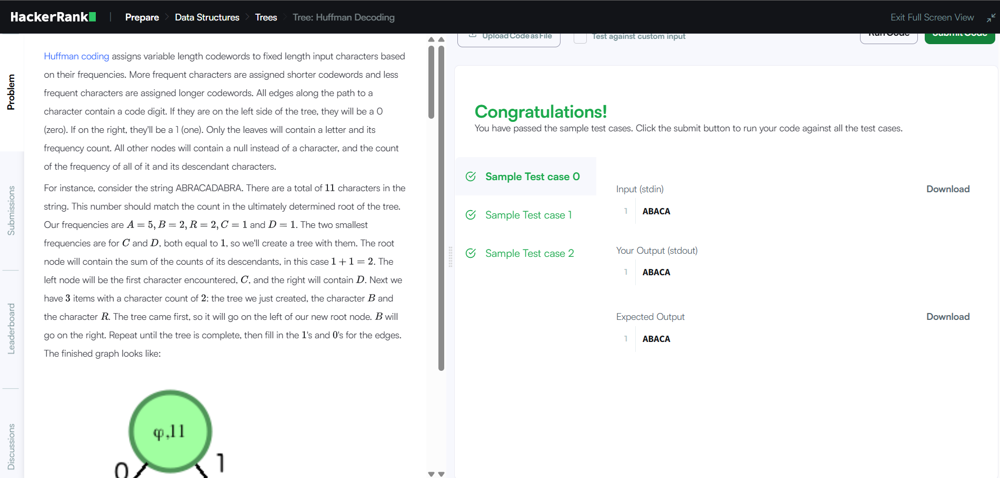

# 🌲 Tree: Huffman Decoding

> HackerRank - Data Structures: Trees  
> Difficulty: Medium  
> [🔗 View Problem on HackerRank](https://www.hackerrank.com/challenges/tree-huffman-decoding/problem?isFullScreen=true)

## Бодлогын өгүүлбэр
Huffman кодчилол нь давтамжид нь үндэслэн тогтмол уртын оролтын тэмдэгтүүдэд хувьсах уртын код үгс оноож өгдөг. Илүү давтамжтай тэмдэгтүүдэд богино код үгс, харин бага давтамжтай тэмдэгтүүдэд урт код үгс оноож өгдөг. Тэмдэгт рүү чиглэсэн зам дахь бүх ирмэгүүд нь код цифр агуулдаг. Хэрэв тэд модны зүүн талд байвал 0 (тэг) байна. Хэрэв баруун талд байвал 1 (нэг) байна. Зөвхөн навчнууд л үсэг болон түүний давтамжийг агуулдаг. Бусад бүх зангилаанууд нь тэмдэгтийн оронд null агуулж, өөрийн болон түүний удамшлын бүх тэмдэгтүүдийн давтамжийн нийлбэрийг агуулдаг.

Жишээлбэл, ABRACADABRA гэсэн мөрийг авч үзье. Мөрөнд нийт 11 тэмдэгт байна. Энэ тоо нь эцэст нь тодорхойлогдсон модны үндэсний тоотой таарах ёстой. Бидний давтамжууд нь A:5,B:2,C:1,D:1,R:2 байна. Хамгийн бага давтамжтай хоёр нь C болон D бөгөөд хоёулаа 1-тэй тэнцүү тул бид тэдгээрийг агуулсан модыг үүсгэнэ. Үндэс зангилаа нь түүний удамшлын тооцооллын нийлбэрийг агуулна, энэ тохиолдолд 2. Зүүн зангилаа нь анх тааралдсан тэмдэгт C байх бөгөөд баруун талд D байна. Дараа нь бидэнд 2 тоотой 3 зүйл байна: бидний саяхан үүсгэсэн мод, тэмдэгт B болон тэмдэгт R. Мод нь эхэндээ байсан тул шинэ үндэс зангилааны зүүн талд орно. R нь баруун талд орно. Мод бүрэн болтол давтаж, дараа нь ирмэгүүдэд 0 болон 1-ийг бөглөнө. Дууссан график нь дараахтай адил харагдана:

          (11)
         /    \
       (6)    (5)
      /   \  /   \
    (3)   R A     (2)
   /   \         /   \
  (2)   B       C     D
 /   \
C     D
Оролтын тэмдэгтүүд нь зөвхөн навчуудад байрладаг. Дотоод зангилаанууд нь ϕ (NULL) тэмдэгт утгатай. Бидний тэмдэгтүүдийн утгыг дараах байдлаар тодорхойлж болно:

A−0
B−111
C−1100
D−1101
R−10
Бидний Huffman кодчилсон мөр нь:
A B R A C A D A B R A
0 111 10 0 1100 0 1101 0 111 10 0
эсвэл
01111001100011010111100

Хоёрдмол утгыг арилгахын тулд Huffman кодчилол нь угтваргүй кодчилолын техник юм. Ямар ч код үг нь бусад код үгсийн угтвар болж гарч ирдэггүй.
Кодчилсон мөрийг тайлахын тулд тэг болон нэгийг дагаж навч руу очиж, тэнд байгаа тэмдэгтийг буцаана.

Та Huffman модны үндэс рүү заагч болон хоёртын кодчилсон мөрийг тайлах ёстой. Та тайлсан мөрийг хэвлэх хэрэгтэй.

Функцийн тайлбар

Доорх засварлагчид decode_huff функцийг гүйцээгээрэй. Энэ нь тайлсан мөрийг буцаах ёстой.

decode_huff нь дараах параметрүүдтэй:

root: Huffman модны үндэс зангилаа руу заагч
s: Huffman кодчилсон мөр
Оролтын формат

Энгийн мөрийг агуулсан нэг мөр оролт байна. Цаад код нь Huffman модыг үүсгээд, дараа нь толгой зангилаа болон кодчилсон мөрийг функцэд дамжуулна.

Хязгаарлалт

1≤∣s∣≤20000
Гаралтын формат

Тайлсан мөрийг нэг мөрөнд хэвлэнэ.

Жишээ оролт

s="1001011"

Жишээ гаралт

ABACA

Тайлбар

S="1001011"
Мөрийг зүүнээс баруун тийш боловсруулна.

S[0]='1': бид үндэсний баруун хүүхэд рүү шилжинэ. Бид 'A' утгатай навч зангилаатай таарна. Бид 'A'-г тайлсан мөрөнд нэмнэ. Бид үндэс рүү буцна.

S[1]='0': бид зүүн хүүхэд рүү шилжинэ.

S[2]='0': бид зүүн хүүхэд рүү шилжинэ. Бид 'B' утгатай навч зангилаатай таарна. Бид 'B'-г тайлсан мөрөнд нэмнэ. Бид үндэс рүү буцна.

S[3] = '1': бид үндэсний баруун хүүхэд рүү шилжинэ. Бид 'A' утгатай навч зангилаатай таарна. Бид 'A'-г тайлсан мөрөнд нэмнэ. Бид үндэс рүү буцна.

S[4]='0': бид зүүн хүүхэд рүү шилжинэ.

S[5]='1': бид баруун хүүхэд рүү шилжинэ. Бид 'C' утгатай навч зангилаатай таарна. Бид 'C'-г тайлсан мөрөнд нэмнэ. Бид үндэс рүү буцна.

S[6] = '1': бид үндэсний баруун хүүхэд рүү шилжинэ. Бид 'A' утгатай навч зангилаатай таарна. Бид 'A'-г тайлсан мөрөнд нэмнэ. Бид үндэс рүү буцна.

Тайлсан мөр = "ABACA"

