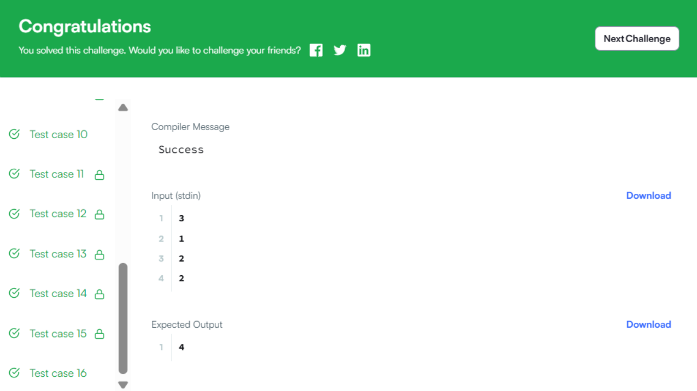

#  Candies

> HackerRank - Algorithms
> Difficulty: Medium  
> [🔗 View Problem on HackerRank](https://www.hackerrank.com/challenges/candies/problem)

## Бодлогын өгүүлбэр
Алис ба чихэр хуваарилалт

Алис бол цэцэрлэгийн багш. Тэрээр ангийнхаа хүүхдүүдэд чихэр өгөхийг хүсдэг. Бүх хүүхэд нэг эгнээнд суугаад, хүүхэд бүр хичээл дэх гүйцэтгэлээрээ үнэлгээний оноотой байдаг. Алис хүүхэд бүрд дор хаяж 1 чихэр өгөхийг хүсдэг. Хэрэв хоёр хүүхэд бие биенийхээ хажууд сууж байвал, өндөр үнэлгээтэй хүүхэд илүү их чихэр авах ёстой. Алис худалдаж авах ёстой нийт чихрийн тоог хамгийн бага байлгахыг хүсдэг.

Жишээ:

arr=[4,6,4,5,6,2]

Тэрээр оюутнуудад дараах хамгийн бага хэмжээний чихрийг өгдөг: [1,2,1,2,3,1]. Тэрээр хамгийн багадаа 10 чихэр худалдаж авах ёстой.

Функцийн тодорхойлолт:

Доорх засварлагчид candies функцийг гүйцэтгэнэ үү.

candies нь дараах параметртэй:

int n: ангид байгаа хүүхдүүдийн тоо int arr[n]: оюутан тус бүрийн үнэлгээ Буцах утга:

int: Алис худалдаж авах ёстой хамгийн бага чихрийн тоо Оролтын формат:

Эхний мөр нь arr-ийн хэмжээ болох n бүхэл тоог агуулна. Дараагийн n мөр тус бүр нь i байрлал дахь оюутны үнэлгээг заасан arr[i] бүхэл тоог агуулна.

Хязгаарлалт:

1≤n≤10**5

1≤arr[i]≤10**5

Жишээ оролт 0:

3 1 2 2 Жишээ гаралт 0:

4 Тайлбар 0:

Энд 1, 2, 2 нь үнэлгээ юм. Хоёр хүүхэд тэнцүү үнэлгээтэй байх үед тэдэнд өөр өөр тооны чихэр өгөхийг зөвшөөрдөг гэдгийг анхаарна уу. Иймээс хамгийн оновчтой хуваарилалт нь 1, 2, 1 байна.

Жишээ оролт 1:

10 2 4 2 6 1 7 8 9 2 1 Жишээ гаралт 1:

19 Тайлбар 1:

Хамгийн оновчтой хуваарилалт нь 1, 2, 1, 2, 1, 2, 3, 4, 2, 1 байна.

Жишээ оролт 2:

8 2 4 3 5 2 6 4 5 Жишээ гаралт 2:

12 Тайлбар 2:

Хамгийн оновчтой хуваарилалт нь 12121212 байна.
