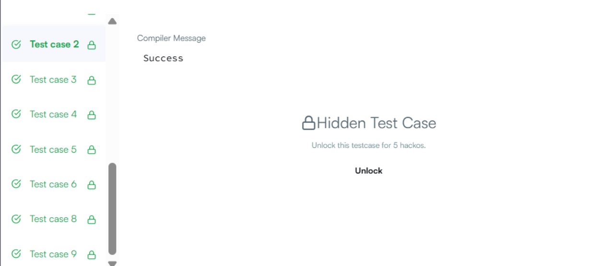

#  Morgan and a String

> HackerRank - Algorithms
> Difficulty: Medium  
> [🔗 View Problem on HackerRank](https://www.hackerrank.com/challenges/morgan-and-a-string/problem)

## Бодлогын өгүүлбэр

Жак болон Даниел хоёр найзууд. Хоёулаа үсэг, ялангуяа том үсэгт дуртай.

Тэд сониноос том үсгүүдийг хайчилж авсан бөгөөд хүн бүр өөрийн цуглуулсан үсгүүдийг овоолгонд хадгалсан байна.

Нэгэн сайхан өдөр Морган Жак болон Даниел дээр зочилжээ. Тэр тэдний цуглуулгуудыг харж, хоёр цуглуулгаас үүссэн лексикографийн хувьд хамгийн бага утгатай минимал мөрийг яаж үүсгэхийг гайхав. Тэрээр овоолгоос зөвхөн овоолгын орой дээр байгаа үсгийг л авч чадна. Морган цуглуулгууд дахь бүх үсгийг ашиглахыг хүсдэг.

Жишээлбэл, Жак a=[A,C,A] цуглуулгатай, Даниел b=[B,C,F] цуглуулгатай гэж үзье. Доорх жишээ нь овоолго тус бүрийн 0 индекс дэх оройг харуулсан байна. Мөрийг дараах байдлаар нэгтгэнэ:

Жак Даниел Үр дүн ACA BCF CA BCF A CA CF AB A CF ABC A F ABCA F ABCAC ABCACF

Export to Sheets Тайлбар: CA болон CF-ийн хооронд тэнцсэн үед сонголт хийгдсэн байгааг анхаарна уу.

Функцийн тодорхойлолт:

Доорх засварлагчид morganAndString функцийг гүйцэтгэнэ үү.

morganAndString нь дараах параметртэй:

string a: Жакийн үсгүүд, 0 индекс дэх орой string b: Даниелийн үсгүүд, 0 индекс дэх орой Буцах утга:

string: гүйцэтгэсэн мөр Оролтын формат:

Эхний мөр нь туршилтын тохиолдлын тоо болох t бүхэл тоог агуулна.

Дараагийн t хос мөрүүд нь дараах байдалтай байна:

Эхний мөр нь a мөрийг агуулна. Хоёр дахь мөр нь b мөрийг агуулна. Хязгаарлалт:

1≤T≤5 1 ≤ ∣a∣,∣b∣ ≤ 10**5

a ба b нь зөвхөн том үсгүүдийг агуулна, ascii [A-Z]. Жишээ оролт:

2 JACK DANIEL ABACABA ABACABA Жишээ гаралт:

DAJACKNIEL AABABACABACABA Тайлбар:

Сонгох эхний үсгүүд нь J болон D байна, учир нь тэд овоолгын орой дээр байна. D-г сонгосон бөгөөд одоогийн сонголтууд нь J болон A байна. A-г сонгосон. Дараа нь хоёр овоолго J болон N-тэй болсон тул J-г сонгоно. Одоогийн мөр нь DA байна. Энэ замаар үргэлжлүүлэн мөрийг гаргана.

