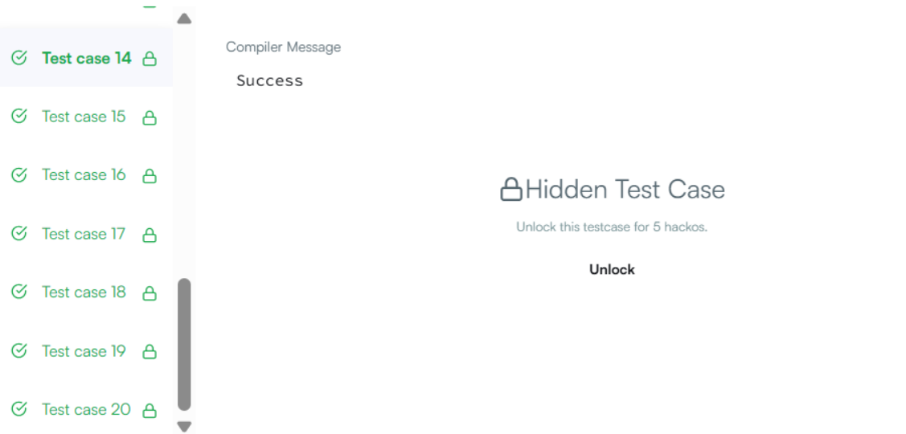

# Build a String

> HackerRank - Algorithms
> Difficulty: Hard  
> [🔗 View Problem on HackerRank](https://www.hackerrank.com/challenges/build-a-string/problem)

## Бодлогын өгүүлбэр

Грег урт нь N байх S мөрийг бүтээхийг хүсэж байна. Хоосон мөрөөс эхлээд тэрээр 2 үйлдэл хийж болно:

S-ийн төгсгөлд тэмдэгт нэмэх нь A доллар. S-ийн аль нэг дэд мөрийг хуулж аваад, түүнийгээ S-ийн төгсгөлд нэмэх нь B доллар. Грег S мөрийг бүтээхэд шаардагдах хамгийн бага мөнгийг тооцоолно уу.

Оролтын формат:

Эхний мөр нь туршилтын тохиолдлын тоо T-г агуулна.

Дараагийн 2×T мөр нь туршилтын тохиолдол бүрийг 2 мөрөөр тодорхойлно: Эхний мөр нь зайгаар тусгаарлагдсан 3 бүхэл тоо болох N, A, B-г агуулна. Хоёр дахь мөр нь S (Грегийн бүтээхийг хүссэн мөр) мөрийг агуулна.

Хязгаарлалт:

1≤T≤3 
1≤N≤3×10**4

1≤A,B≤10000 S нь зөвхөн жижиг үсгүүдээс бүрдэнэ. Гаралтын формат:

Туршилтын тохиолдол бүрийн хувьд нэг мөрөнд S-г бүтээхэд шаардагдах хамгийн бага зардлыг (бүхэл тоогоор) хэвлэнэ.

Жишээ оролт:

2 9 4 5 aabaacaba 9 8 9 bacbacacb Жишээ гаралт:

26 42 Тайлбар:

Туршилтын тохиолдол 0:

S initial​=""; S final​="aabaacaba"

"a" нэмэх: S="a"; зардал нь 4 "a" нэмэх: S="aa"; зардал нь 4 "b" нэмэх: S="aab"; зардал нь 4 "aa" хуулж нэмэх: S="aabaa"; зардал нь 5 "c" нэмэх: S="aabaac"; зардал нь 4 "aba" хуулж нэмэх: S="aabaacaba"; зардал нь 5

Зардал бүрийг нэгтгэвэл, 4+4+4+5+4+5=26 болж, Туршилтын тохиолдол 1-ийн хувьд бидний гаралт 26 байна.

Туршилтын тохиолдол 1:

S initial​=""; S final​="bacbacacb"

"b" нэмэх: S="b"; зардал нь 8 "a" нэмэх: S="ba"; зардал нь 8 "c" нэмэх: S="bac"; зардал нь 8 "bac" хуулж нэмэх: S="bacbac"; зардал нь 9 "acb" хуулж нэмэх: S="bacbacacb"; зардал нь 9

Зардал бүрийг нэгтгэвэл, 8+8+8+9+9=42 болж, Туршилтын тохиолдол 2-ын хувьд бидний гаралт 42 байна.
