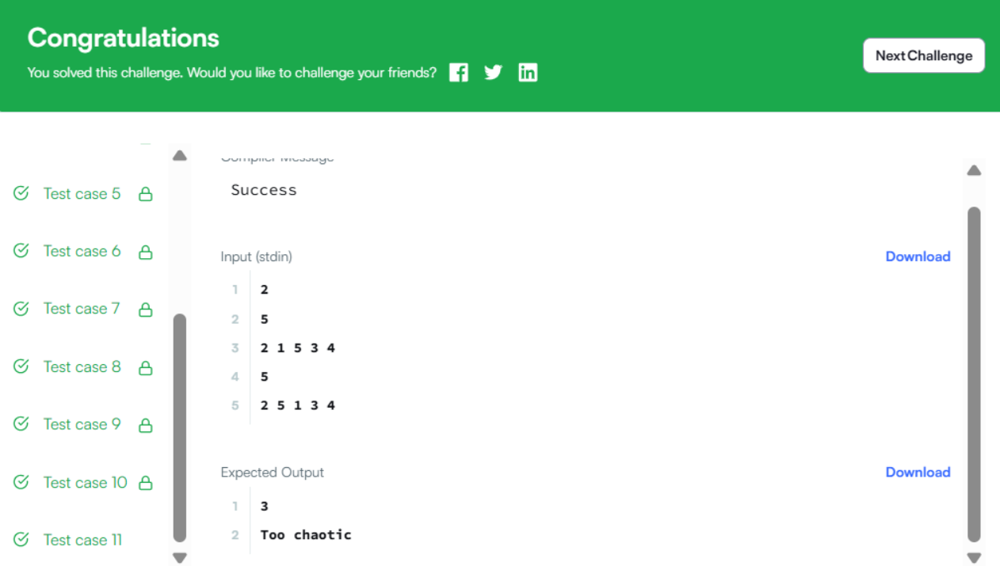

Бодлого 29
Уралдааны эгнээнд буй хүмүүсийг зохион байгуулах: Хамгийн бага авлига болон "Хэтэрхий эмх замбараагүй" байдал

Энэ бол Шинэ жилийн өдөр бөгөөд хүмүүс Wonderland усан гулсуурын уралдааны эгнээнд зогсож байна. Хүн бүр эхний байрлалаа 1-ээс n хүртэлх тоогоор тэмдэглэсэн наалт зүүсэн байна. Аливаа хүн өөрийнхөө урд зогсож буй хүнийг авлигадаж байрлалаа сольж болох боловч тэд анхны наалтаа зүүсэн хэвээр байна. Нэг хүн хамгийн ихдээ хоёр хүнийг авлигадаж болно.

Өгөгдсөн дарааллыг гаргахад шаардагдах хамгийн бага авлигийн тоог тодорхойлно уу. Хэрэв хоёроос илүү хүн авлигадсан бол "Too chaotic" (Хэтэрхий эмх замбараагүй) гэж хэвлэнэ үү.

Жишээ:

q=[1,2,3,5,4,6,7,8]

Хэрэв 5 дугаар хүн 4 дүгээр хүнийг авлигадвал эгнээ ийм харагдана: 1,2,3,5,4,6,7,8. Зөвхөн 1 авлига шаардагдана. 1-ийг хэвлэнэ.

q=[4,1,2,3]

4 дүгээр хүн 3 хүнийг авлигадсан нь одоогийн байрлалд хүрэхэд хүргэсэн. "Too chaotic" гэж хэвлэнэ.

Функцийн тодорхойлолт:

Доорх засварлагчид minimumBribes функцийг гүйцэтгэнэ үү.

minimumBribes нь дараах параметртэй:

int q[n]: Бүх авлигийн дараах хүмүүсийн байрлал Буцах утга:

Ямар ч утга буцахгүй. Шаардлагатай хамгийн бага авлигийн тоог эсвэл хэрэв хэн нэгэн 2-оос илүү хүнийг авлигадсан бол "Too chaotic" гэж хэвлэнэ. Оролтын формат:

Эхний мөр нь t бүхэл тоо бөгөөд туршилтын тохиолдлын тоог заана.

Дараагийн t хос мөрүүд нь дараах байдалтай байна:

Эхний мөр нь n бүхэл тоо бөгөөд эгнээний хүмүүсийн тоог заана. Хоёр дахь мөр нь n зайгаар тусгаарлагдсан бүхэл тоонууд бөгөөд эгнээний эцсийн төлөвийг тодорхойлно. 

Хязгаарлалт:

1≤t≤10 
1≤n≤10**5

Дэд даалгаврууд:

60% онооны хувьд 1≤n≤10**3

100% онооны хувьд 1≤n≤10**5

Жишээ оролт:

2 5 2 1 5 3 4 5 2 5 1 3 4 Жишээ гаралт:

3 Too chaotic Тайлбар:

Туршилтын тохиолдол 1:

Эхний төлөв:

[Зураг 1: Эхний эгнээний байрлал 1, 2, 3, 4, 5]

5 дугаар хүн 4 дүгээр хүнийг авлигадаж нэг байрлал урагшилсны дараа:

[Зураг 2: 5 дугаар хүн 4 дүгээр хүнийг авлигадаж урагшилсны дараах эгнээний байрлал 1, 2, 3, 5, 4]

Одоо 5 дугаар хүн 3 дугаар хүнийг авлигадаж өөр нэг байрлал урагшилсны дараа:

[Зураг 3: 5 дугаар хүн 3 дугаар хүнийг авлигадаж урагшилсны дараах эгнээний байрлал 1, 2, 5, 3, 4]

Мөн 2 дугаар хүн 1 дүгээр хүнийг авлигадаж нэг байрлал урагшилсны дараа:

[Зураг 4: 2 дугаар хүн 1 дүгээр хүнийг авлигадаж урагшилсны дараах эгнээний байрлал 2, 1, 5, 3, 4]

Ингээд эцсийн төлөв нь 2, 1, 5, 3, 4 гурван авлигын үйл ажиллагааны дараа үүснэ.

Туршилтын тохиолдол 2:

Нэг хүн хоёроос илүү хүнийг авлигадаж болохгүй, гэхдээ 5 дугаар хүн тийм үйлдэл хийсэн бололтой. Өгөгдсөн оролтын төлөвт хүрэх боломжгүй юм.
