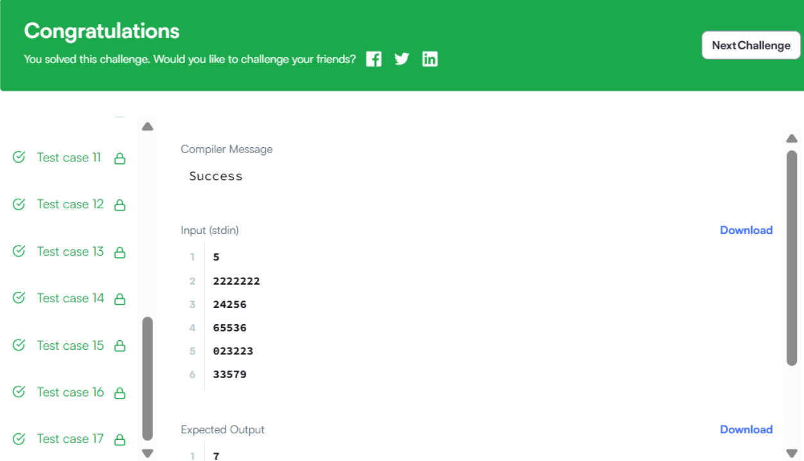

Бодлого 32
Багш Твотвогийн тооны хүчүүдийн туршилт

Багш Твотво нэрнээсээ харахад 2-ын зэрэгт маш дуртай. Түүнээс гадна тэрээр 800 гэсэн тоонд онцгой сонирхолтой. Тэрээр 2-ын зэрэгт дээр сонирхолтой туршилтууд хийдэгээрээ алдартай.

Нэгэн өдөр тэрээр ангидаа тоглоом тогложээ. Тэрээр 0-ээс 9 хүртэлх тоо бичсэн дугаартай хавтангууд авчирсан байв. Тэрээр оюутнуудыг нэг эгнээнд зогсоогоод оюутан бүрд нэг дугаартай хавтан өгсөн. Дараа нь тэрээр эгнээндээ тасралтгүй зогсож буй i индексээс j индекс (i≤j) хүртэлх зарим оюутнуудыг дуудаж, тэдний хүчийг олохыг хүсэв.

Оюутнуудын i-ээс j хүртэлх бүлгийн хүч нь дараах байдлаар тодорхойлогдоно:

strength(i, j) { if a[i] = 0 return 0; //Хэрэв бүлгийн эхний хүүхдийн утга 0 байвал, бүлгийн хүч 0 байна value = 0; for k from i to j value = value * 10 + a[k] return value; } Багш i болон j-ийн боломжит бүх хослолыг дуудаж, бүлэг тус бүрийн хүчийг тэмдэглэж авав. Одоо 2-ын зэрэгт сонирхолтой тул тэрээр хичнээн хүч 2-ын зэрэгт болохыг олж мэдэхийг хүсч байна. Одоо багшид хариултыг олох нь таны үүрэг.

Оролтын формат:

Эхний мөр нь туршилтын тохиолдлын тоо T-г агуулна.

Дараагийн T мөр нь A мөр хэлбэрээр эгнээнд зогсож буй оюутнуудын барьж байсан дугаартай хавтангуудыг агуулна.

Хязгаарлалт:

1≤T≤100 1≤len(A)≤10**5

0≤A[i]≤9 Гаралтын формат:

0≤x≤800 байх 2 x хэлбэрийн хүчнүүдийн нийт тоог гаргана.

Жишээ оролт 0:

5 2222222 24256 65536 023223 33579 Жишээ гаралт 0:

7 4 1 4 0 Тайлбар 0:

Дараах тайлбаруудад бүлэг i−j гэдэг нь i индексээс j индекс хүртэлх оюутны бүлэг юм (1-ээр эхэлсэн индекс).

Эхний тохиолдолд зөвхөн 2 нь 2-ын зэрэгт хэлбэртэй байна. Энэ нь 1-1, 2-2, 3-3, 4-4, 5-5, 6-6, 7-7 бүлгүүдэд долоон удаа байдаг. Хоёр дахь тохиолдолд 2, 4, 256 нь шаардлагатай хэлбэртэй байна. 2 нь 1-1 болон 3-3 бүлгийн хүч, 4 нь 2-2 бүлгийн хүч, 256 нь 3-5 бүлгийн хүч. Гурав дахь тохиолдолд 65536 нь шаардлагатай хэлбэртэй цорын ганц тоо юм. Энэ нь 1-5 бүлгийн хүч. Дөрөв дэх тохиолдолд 2, 32 нь 2-ын зэрэгт хэлбэртэй байна. 1-2 бүлэг нь 0, 2 утгатай боловч эхний утга нь 0 тул хүч нь 0 юм. Тав дахь тохиолдолд аль ч бүлэг шаардлагатай хэлбэрийн хүчтэй биш байна.

