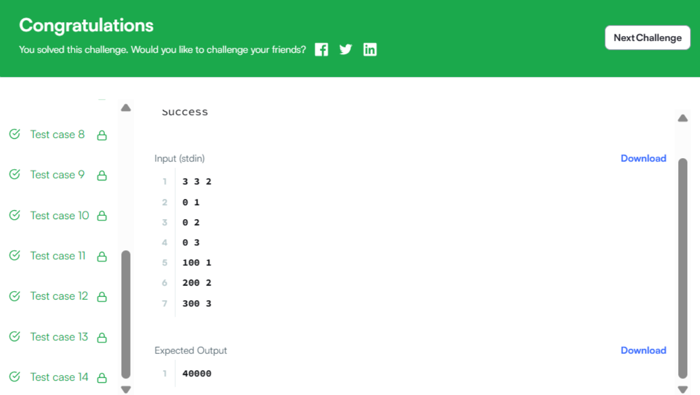

Бодлого 34
Унадаг дугуйн уралдаанд оролцох бэлтгэл

Нэг хотод (сүлжээ хэлбэртэй) N унадаг дугуйчин, M дугуй байна. Бүх дугуйчид HackerRace тэмцээнд оролцохыг хүсэж байгаа боловч харамсалтай нь зөвхөн K дугуйчин л уралдаанд багтах боломжтой. Жак HackerRace-ийг зохион байгуулж байгаа бөгөөд уралдааныг аль болох хурдан эхлүүлэхийг хүсч байна. Уралдааныг эхлүүлэх хугацааг багасгахын тулд Жак дугуйчдад эхний K дугуйг хамгийн бага хугацаанд олж авах аргаар зааварчилгаа өгдөг.

Дугуйчин бүр нэгж хурдтайгаар хөдөлдөг бөгөөд нэг дугуйг зөвхөн нэг дугуйчин л авч болно. Дугуйчин ямар ч чиглэлд хөдөлж болно. Дугуй болон дугуйчдын хоорондох зайг Евклидийн зайгаар тооцно.

Жак уралдааныг аль болох хурдан эхлүүлэхэд шаардагдах хугацааны квадратыг мэдэхийг хүсч байна.

Оролтын формат:

Эхний мөр нь зайгаар тусгаарлагдсан гурван бүхэл тоо N, M, болон K-г агуулна. Дараагийн N мөр нь N дугуйчдын координат бүхий N хос бүхэл тоог агуулна. Хос бүр зайгаар тусгаарлагдсан байна. Дараагийн M мөр нь M дугуйнуудын координатыг мөн адил тэмдэглэнэ.

Хязгаарлалт:

1≤N≤250 
1≤M≤250 
1≤K≤min(N,M) 
0≤x i​,y i​≤10**7

Гаралтын формат:

Шаардагдах хугацааны квадратыг агуулсан нэг мөр.

Жишээ оролт:

3 3 2 0 1 0 2 0 3 100 1 200 2 300 3 Жишээ гаралт:

40000 Тайлбар:

Уралдаанд хоёр дугуйчин шаардлагатай. Эхний дугуйчин (0,1) эхний дугуйд (100,1) 100 цагийн нэгж дотор хүрч чадна. Хоёр дахь дугуйчин (0,2) хоёр дахь дугуйд (200,2) 200 цагийн нэгж дотор хүрч чадна. Энэ нь хамгийн оновчтой шийдэл бөгөөд 200 цагийн нэгж зарцуулна. Иймээс гаралт нь 200 2 =40000.

