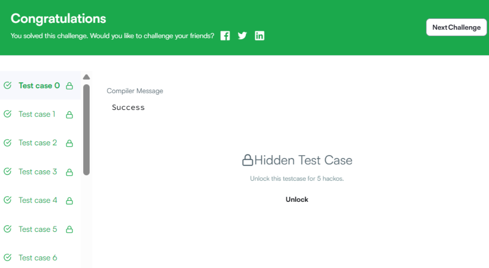

Бодлого 38
Нэг string-ийг өөр string-ийн хүүхэд гэж нэрлэдэг нь хэрэв эх string-ээс 0 эсвэл түүнээс дээш тооны тэмдэгтийг устгаснаар үүсгэх боломжтой бол хэлнэ. Үсгүүдийг дахин байрлуулах боломжгүй. Тэнцүү урттай хоёр string өгөгдсөн үед, хоёулангийнх нь хүүхэд байх боломжтой хамгийн урт string-ийн уртыг ол.

Жишээ

s1= ′ABCD′ s2=′ABDC′

Эдгээр string нь хамгийн ихдээ 3 урттай нийтлэг хүүхэдтэй: ABC болон ABD. Эдгээрийг хоёр string-ээс D эсвэл C-г хассанаар үүсгэх боломжтой. 3-ийг буцаана.

Функцийн тайлбар

Доорх засварлагчид commonChild функцийг гүйцэтгэнэ үү.

commonChild нь дараах параметртэй:

string s1: string string s2: өөр string Буцаах утга

int: оролтын string-үүдийн нийтлэг хүүхэд болох хамгийн урт string-ийн урт Оролтын формат

Хоёр мөр байна, тус бүр нь string s1 болон s2.

Хязгаарлалт

1≤∣s1∣,∣s2∣≤5000, энд ∣s∣ нь "s-ийн урт" гэсэн үг. Бүх тэмдэгтүүд нь ascii[A-Z] мужид багтах том үсгүүд байна. Жишээ Оролт

HARRY SALLY

Жишээ Гаралт

2

Тайлбар

HARRY болон SALLY-аас тэг эсвэл түүнээс дээш тэмдэгтийг устгаснаар үүсгэх боломжтой хамгийн урт string нь AY, түүний урт нь 2.

Жишээ Оролт 1

AA BB

Жишээ Гаралт 1

0

Тайлбар 1

AA болон BB нь нийтлэг тэмдэгтгүй тул гаралт нь 0.

Жишээ Оролт 2

SHINCHAN NOHARAAA

Жишээ Гаралт 2

3

Тайлбар 2

SHINCHAN болон NOHARAAA-ийн хооронд дарааллыг хадгалан үүсгэх боломжтой хамгийн урт string нь NHA.

Жишээ Оролт 3

ABCDEF FBDAMN

Жишээ Гаралт 3

2

Тайлбар 3

BD нь өгөгдсөн string-үүдийн хамгийн урт хүүхэд юм.

